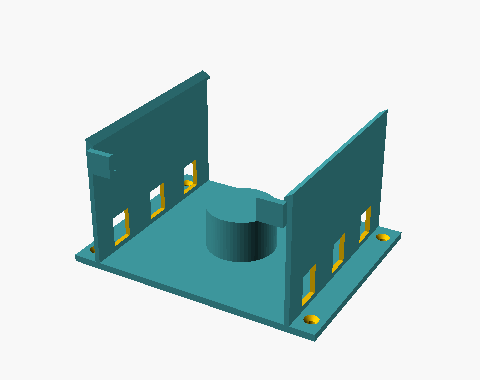
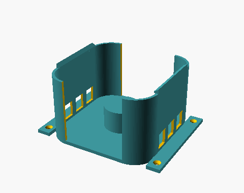
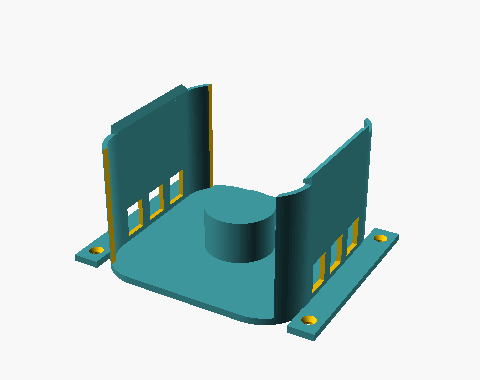
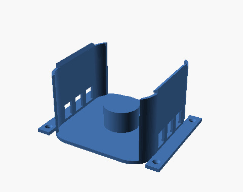
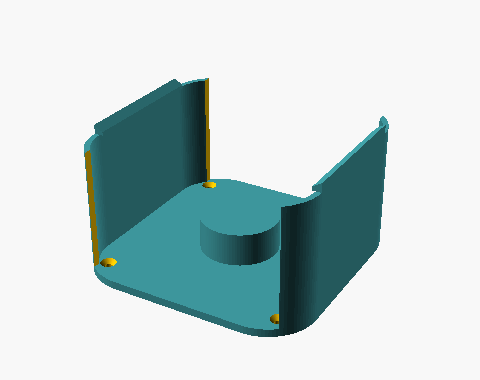
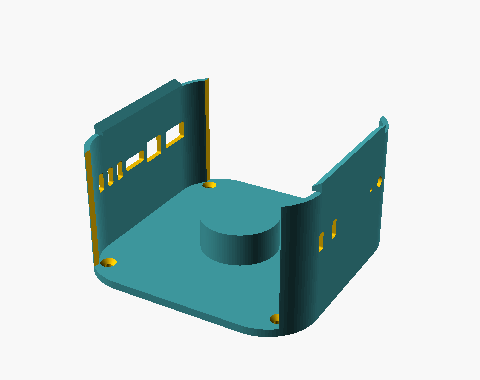
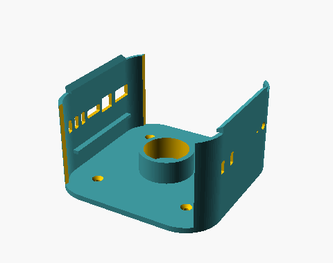
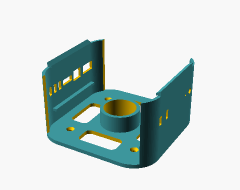
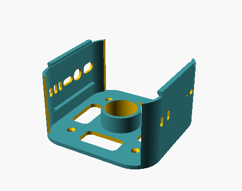
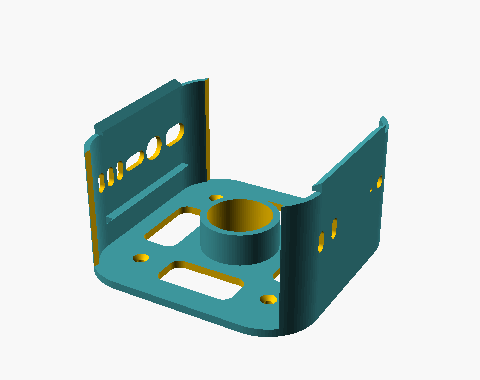

# Visual Index — Mac Mini Wall Mount Versions

Thumbnails in `thumbs/`. Full prompts in `PROMPTS.md` · cave version in `caveprompts.md` · changelog in `VERSIONS.md`.

| | Version | What changed | Cave grunt |
|---|---|---|---|
|  | **v01** straight-rails, ports-down | first design: square corners, ports out the down edge | *keep all hole and breath-slit free* |
|  | **v02** corner-hug, narrow | rounded frame hugs the 25 mm corners | *make the cradle hug it tight* |
|  | **v03** wide-open ports | opening widened so ports clear | *move so plug go in* |
|  | **blender_port-traced** | real ports traced in Blender → panel cutouts | *use spirit Blender* |
|  | **v04** short spacer / min footprint | ¾″ spacer, no vents, ears gone, screws inside | *shut wind-hole, shrink the flat slab* |
|  | **v05** side ports + LED | rotated 90°, ports in the rails, LED added | *poke small glow-eye hole* |
|  | **v06** ridges / hollow post | rest ridges, screws in ½″, hollow standoff | *scoop fat post hollow* |
|  | **v07** bored + lightened | bore through plate, 4 lightening windows | *Ugg use less of mud* |
|  | **v08** obround ports | ports rounded/widened for print-in-place | *build with no crutch-stick* |
|  | **v09** chamfered rest ridges ← current | lower ledges chamfered self-supporting | *so it stand alone* |

*(The `vNNb` files are the same designs cut with Blender's boolean — visually identical to their `vNN` thumbnail.)*
